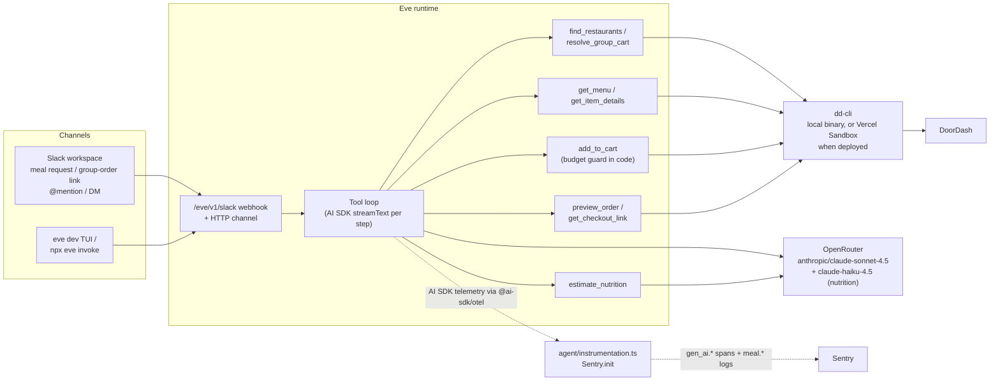
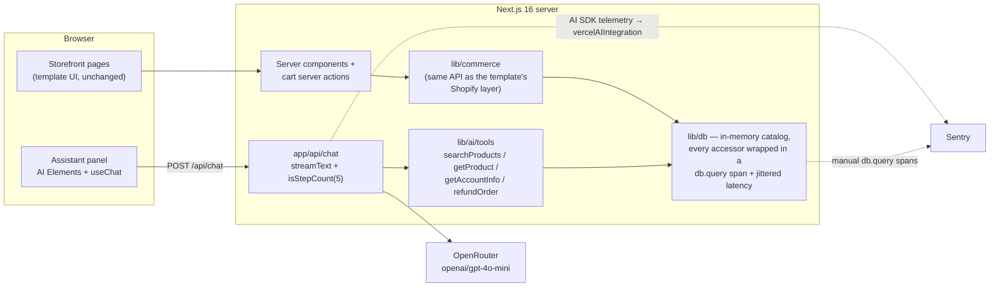
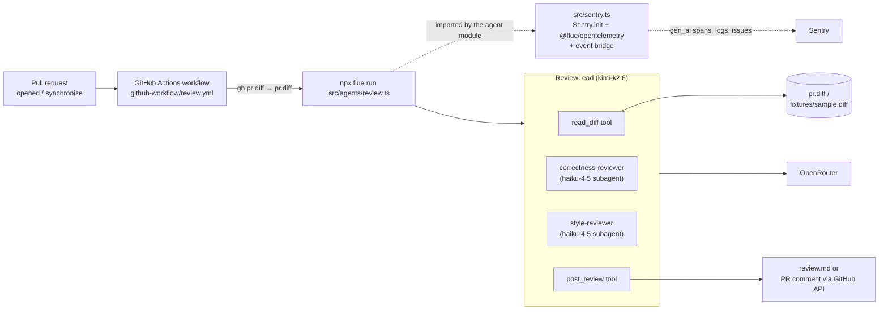

# Architecture

How each demo is put together, how one user interaction becomes one Sentry
trace, and how to exercise it. All three demos target the same Sentry data
model — `gen_ai.invoke_agent` containers with `gen_ai.*` model-call and
`gen_ai.execute_tool` children — but produce it three different ways:

1. **slack-agent-eve** — the framework (Eve) registers `@ai-sdk/otel` with the
   AI SDK, which emits `gen_ai.*` spans straight into Sentry's tracer provider.
2. **storefront-commerce** — the app calls the AI SDK directly; the same
   integration instruments it, and hand-written `db.query` spans nest under
   the agent's tool spans.
3. **github-harness-flue** — the framework (Flue) emits spec-compliant
   `gen_ai.*` OTel spans itself; Sentry just owns the tracer provider.

Common ground: every model call routes through OpenRouter (raw model slugs are
passed through unchanged so Sentry's pricing database resolves cost),
`tracesSampleRate` is 1.0 (demo setting), and prompt/response recording is
deliberately ON — these are demos, and seeing full conversations on spans is
the point. All Sentry SDKs are pinned at 10.69.0.

> **A note on model-call span names.** Sentry's `vercelAIIntegration` (demo 2)
> classifies AI SDK model calls as `generate_content`, so those spans render as
> `generate_content <model>` with op `gen_ai.generate_content`. The
> `@ai-sdk/otel` adapter (demo 1) and Flue's adapter (demo 3) emit
> `chat <model>` instead. Same dashboards, same token and cost handling — just
> two valid `gen_ai.operation.name` values from the spec. Sentry's AI views key
> off the `gen_ai.operation.type` attribute, so both shapes render identically.

---

## 1. slack-agent-eve — DoorDash ordering bot on Eve

### Purpose

"Mealbot" does two jobs from Slack. Ask it for breakfast, lunch, or dinner
and it finds nearby restaurants, builds three picks from one menu, prices the
cart, and hands back a DoorDash checkout link. Post a group-order link and it
resolves the shared cart instead, then adds your pick to it. **It never
submits an order** — for a personal order the last step is the link, for a
group order it is the cart.

It shows how to trace an agent whose loop you don't own: Eve runs the tool
loop, picks when to call the model, and executes tools — the demo hooks
Sentry into Eve's single instrumentation seam and gets the full agent tree
without touching agent or tool code. It also demonstrates a tool that makes
its own LLM call (`estimate_nutrition`), which lands as a nested `gen_ai`
span inside the tool span, and domain wide events (`meal.pick.added`) that
carry the calories and protein of every pick.

### Architecture

Eve builds the agent from the filesystem: `agent/instructions.md` is the
system prompt, `agent/agent.ts` wires an OpenRouter provider instance as the
model (bypassing the Vercel AI Gateway), and each file in `agent/tools/`
becomes a tool named after the file. Tools shell out to `dd-cli`
(`--json-output`, data under `structuredContent`) with a fixed sanitized
`--intent`; the `add_to_cart` tool enforces the budget (a group order's own
per-person spend limit, else `MEAL_BUDGET_USD`) in code by re-pricing picks
from `restaurant-item-details` before mutating the cart.

`dd-cli` is a local binary that signs in through a browser and stores its
token in the OS keychain — neither of which exists in a deployment. So
`agent/lib/dd.ts` branches: locally it runs the installed binary, and when
deployed it runs the CLI inside a **named Vercel Sandbox** authenticated by
`DD_CLI_ACCESS_TOKEN` (minted with `dd-cli export-token`). One sandbox is
shared across function invocations, so the install cost is paid once.
`DD_CLI_SANDBOX` decides which path is used.



The Sentry wiring (there is no official Eve integration; this composes both
sides' documented primitives):

- `agent/instrumentation.ts` is Eve's auto-discovered hook. Its `setup`
  callback runs `Sentry.init` at server startup, which registers the global
  OpenTelemetry tracer provider. Eve registers `@ai-sdk/otel` with the AI SDK,
  so every model and tool call already arrives as a `gen_ai.*` span through
  that provider — no Sentry AI integration is needed.
- **Sentry's `VercelAI` integration is filtered out of the defaults.** `ai` 7
  exposes the same telemetry twice: through the integration list on
  `globalThis` (where Eve registers `@ai-sdk/otel`) and through the
  `ai:telemetry` diagnostics channel (which `vercelAIIntegration` subscribes
  to). Keeping both records every model and tool call twice and doubles the
  token and cost sums.
- Content capture is one switch: `dataCollection.genAI.inputs/outputs` on
  `Sentry.init`, driven by the same env flags as Eve's own `recordInputs` /
  `recordOutputs`.
- The default segment trace lifecycle is deliberate. An earlier version needed
  `traceLifecycle: "stream"` to work around
  [vercel/eve#1854](https://github.com/vercel/eve/issues/1854), where a turn's
  later steps parented to an already-ended span and were dropped. Eve 0.32
  fixed that, and streaming had to go: it buffers spans, and a Vercel function
  freezes as soon as it responds, so a deployment reported no AI spans at all.
- `traceChannelRequests: true` wraps inbound channel HTTP requests in a SERVER
  span, so traces start at the webhook, not at the first model call.
- The `step.started` event hook runs on the same execution path as each model
  call: it calls `Sentry.setConversationId(threadTs)` (the Slack thread is the
  conversation) and `Sentry.setUser({ id: triggeringUserId })`, and returns
  `runtimeContext` that stamps `slack.channel_id` / `slack.user_id` onto every
  AI span.

Tools contain **no manual Sentry spans** — Eve's own `ai.toolCall` spans
already become `gen_ai.execute_tool`, and doubling them would double-count the
AI Agents dashboard's Tool Errors widget.

### Call stack → span tree

A group-order link posted in Slack, through to the three options:

| Call stack | Span produced | Emitted by |
| --- | --- | --- |
| Slack POSTs the event to the webhook | `POST /eve/v1/slack` — `http.server` | Eve's `traceChannelRequests` (OTel SERVER span) |
| Eve starts a turn | `ai.eve.turn` (keeps its raw name; carries `eve.session.id`, `eve.turn.id`) | Eve's own tracer (`trace.getTracer("eve")`) |
| Each step: Eve calls `streamText` | `invoke_agent <model>` and `chat <model>`, carrying `gen_ai.operation.type` of `agent` / `ai_client` | `@ai-sdk/otel`, which Eve registers with the AI SDK |
| Eve executes a tool (shells to `dd-cli`) | `execute_tool <tool>` with `gen_ai.tool.*` attributes | Same adapter, from the AI SDK's tool events |
| `estimate_nutrition` calls `generateObject` itself | `execute_tool estimate_nutrition` with a **nested** `chat anthropic/claude-haiku-4.5` child | The adapter covers every AI SDK call in the process, including ones made inside tools |

```text
POST /eve/v1/slack                             http.server — inbound Slack webhook
└─ ai.eve.turn                                 eve's per-turn container
   ├─ invoke_agent anthropic/claude-sonnet-4.5 step 1
   │  ├─ chat anthropic/claude-sonnet-4.5
   │  └─ execute_tool find_restaurants
   ├─ invoke_agent anthropic/claude-sonnet-4.5 step 2 — execute_tool get_menu
   ├─ invoke_agent anthropic/claude-sonnet-4.5 step 3
   │  └─ execute_tool estimate_nutrition
   │     └─ chat anthropic/claude-haiku-4.5    nested tool-internal LLM call
   └─ invoke_agent anthropic/claude-sonnet-4.5 final step
      └─ chat anthropic/claude-sonnet-4.5      writes the Slack reply
```

Sentry's AI views select on the `gen_ai.operation.type` attribute rather than
on `span.op`, so the Agent Timeline and the AI Agents module read this tree
directly.

Local runs (`eve dev` / `eve invoke`) produce the identical tree under the
HTTP channel's server span instead of the Slack webhook. Every AI span also
carries the Slack context from the runtime hook (as
`vercel.ai.settings.context.slack.channel_id` / `.slack.user_id`) and
`gen_ai.conversation.id` = the Slack thread `ts`.

### Spans vs logs

The split is deliberate. Spans are the **system** record and are entirely
auto-instrumented — tool arguments, models, tokens, latency. Logs are the
**domain** record, written by hand where the business event happens, and
nothing is mirrored across both:

| Event | Written by | Carries |
| --- | --- | --- |
| `meal.restaurant.presented` | `present_restaurant_options` | store, index, craving |
| `meal.option.presented` | `present_meal_options` | lane, item, price, calories, protein |
| `meal.pick.added` | `add_to_cart` | item, quantity, price, budget, calories, protein |
| `meal.checkout.offered` | `get_checkout_link` | store, total, currency |

The numeric attributes are typed, so Explore, dashboards, and metric alerts
can sum them — `sum(tags[meal.calories,number])` grouped by `user.id` is what
drives the nutrition dashboard and the "protein under target" alert.

### Testing with Sentry

```bash
cd slack-agent-eve
npm install
cp .env.example .env    # fill OPENROUTER_API_KEY + SENTRY_DSN
npm run dev             # eve dev TUI — chat with the full agent loop locally
# or one non-interactive turn (a link the signed-in dd-cli account hosts):
npx eve invoke "Options for this group order please: https://drd.sh/cart/XXXX/"
```

Requires `dd-cli` installed and signed in on the same machine (`dd-cli login`,
keychain auth). Asking for a meal ("find me sushi for dinner") exercises the
whole personal flow; a group-order link hosted by — or joined from — that
DoorDash account exercises the shared-cart flow.

For the Slack surface, create the app from the demo's
`slack-app-manifest.yaml`, install it, fill `SLACK_BOT_TOKEN` +
`SLACK_SIGNING_SECRET`, and invite the bot to a channel. Posting a
group-order link triggers it without a mention, via the `message.channels`
subscription plus the channel's `onMessage` link matcher.

Locally, point both `request_url` values at a tunnel (e.g.
`cloudflared tunnel --url http://localhost:3000`). Deployed, point them at
the Vercel production URL — a Slack app delivers to one URL at a time, so
this is an either/or.

To deploy: `npx eve deploy`, set the app's env vars in Vercel, and add
`DD_CLI_ACCESS_TOKEN` from `dd-cli export-token` so the sandbox can
authenticate. Two things to know — `eve deploy` overwrites `.env.local` with
Vercel's environment, and Vercel Authentication must not cover production or
Slack's webhooks get a 401.

In Sentry:

- **Insights → AI Agents** — the `doordash-agent` aggregates: runs, token
  usage, model cost (OpenRouter slugs resolve in Sentry's pricing data), tool
  error rate.
- **Explore → Traces** — one trace per turn with the tree above; prompts and
  outputs are visible on spans because content capture is on.
- **Explore → Conversations** — each Slack thread groups into one
  conversation, with the Slack user id in the User column.
- **Dashboards and alerts** — the `meal.*` logs drive a nutrition dashboard
  (calories, protein, and spend per person) and two metric alerts on the logs
  dataset: calories over a daily target, and protein under one.

If you see every model and tool call twice, Sentry's `VercelAI` integration
has come back: it is a default integration, so it must be filtered out of the
defaults by name, not merely left out of the `integrations` array.

---

## 2. storefront-commerce — AI shopping assistant in Next.js Commerce

### Purpose

A real storefront (the Next.js Commerce template, upgraded to Next 16) with an
AI shopping assistant in a slide-over panel. It shows agent tracing living
*inside* a normal application trace: the same fake database serves both the
storefront pages and the agent's tools, so `db.query` spans appear in ordinary
page-load traces *and* nested under `gen_ai.execute_tool` spans — one Queries
insights module, two kinds of callers.

### Architecture



- **Data layer**: `lib/commerce` re-implements the template's Shopify contract
  (same function names, signatures, and types) on top of `lib/db`, so every
  template component works unchanged. `lib/db` is an in-memory store whose
  every accessor runs inside `Sentry.startSpan({ op: "db.query", name: "<parameterized SQL>", attributes: { "db.system": "sqlite" } })`
  with 20–120 ms of jittered latency — exactly the three things Queries
  insights needs to parse and aggregate a span as a database query.
- **Assistant**: AI Elements components (`conversation`, `message`,
  `prompt-input`, `suggestion`) around `useChat`. Tool results render as
  generative UI — custom product/account cards that link into the storefront —
  via the AI SDK's typed `tool-*` message parts (no generic Tool component).
- **Chat route** (`app/api/chat/route.ts`, Node runtime): `streamText` with
  the OpenRouter provider, three zod-schema tools, loop capped at
  `isStepCount(5)`, and `experimental_telemetry: { functionId: "shopping-assistant", recordInputs: true, recordOutputs: true }`.
  Before the AI call it runs `Sentry.setUser(...)` (demo customer) and
  `Sentry.setConversationId(id)` (the `useChat` session id from the request
  body) so multi-turn chats group as one conversation.
- **Sentry setup**: standard `@sentry/nextjs` manual setup
  (`instrumentation.ts`, `sentry.server.config.ts`, `sentry.edge.config.ts`,
  `instrumentation-client.ts`, `global-error.tsx`), with
  `vercelAIIntegration({ force: true, recordInputs: true, recordOutputs: true })`
  in the server config. Source-map upload is skipped when
  `SENTRY_AUTH_TOKEN` is unset, so builds pass with zero env vars.

### Call stack → span tree

"Where is my order?" in the assistant panel:

| Call stack | Span produced | Emitted by |
| --- | --- | --- |
| `useChat` POSTs to the route | `POST /api/chat` — `http.server` | `@sentry/nextjs` HTTP auto-instrumentation |
| Route sets user + conversation id | no span — isolation-scope state picked up by the AI spans below | manual (`Sentry.setUser` / `Sentry.setConversationId`) |
| `streamText(...)` starts the loop | `invoke_agent shopping-assistant` — `gen_ai.invoke_agent` | `vercelAIIntegration` (from `ai.streamText`; named by `functionId`) |
| Model call, decides to use a tool | `generate_content openai/gpt-4o-mini` — `gen_ai.generate_content` | `vercelAIIntegration` (from `ai.streamText.doStream`) |
| AI SDK executes `getAccountInfo` | `execute_tool getAccountInfo` — `gen_ai.execute_tool` | `vercelAIIntegration` (from `ai.toolCall`) |
| Tool calls `db.selectCustomer(...)` | `SELECT * FROM customers WHERE id = ?` — `db.query` | **manual** `Sentry.startSpan` in `lib/db`'s `query()` wrapper |
| Tool calls `db.selectOrders(...)` | `SELECT * FROM orders WHERE customer_id = ? ORDER BY created_at DESC LIMIT ?` — `db.query` | manual, same wrapper |
| Model reads the tool result, answers | `generate_content openai/gpt-4o-mini` | `vercelAIIntegration` |

The manual `db.query` spans nest under the tool span automatically: the AI
SDK runs the tool's `execute` inside the `ai.toolCall` span's context, and
`Sentry.startSpan` parents to whatever span is active — no explicit plumbing.

```text
POST /api/chat                                       http.server
└─ invoke_agent shopping-assistant                   gen_ai.invoke_agent
   ├─ generate_content openai/gpt-4o-mini            gen_ai.generate_content  (streaming; prompts, tokens, cost)
   ├─ execute_tool searchProducts                    gen_ai.execute_tool      (args + result recorded)
   │  └─ SELECT * FROM products WHERE title LIKE ? OR description LIKE ? OR tags LIKE ?
   │                                                 db.query  (db.system=sqlite, ~20–120 ms)
   ├─ generate_content openai/gpt-4o-mini            gen_ai.generate_content  (model reads the tool result)
   ├─ execute_tool getAccountInfo                    gen_ai.execute_tool      (when asked about orders)
   │  ├─ SELECT * FROM customers WHERE id = ?        db.query
   │  └─ SELECT * FROM orders WHERE customer_id = ? ORDER BY created_at DESC LIMIT ?
   │                                                 db.query
   └─ generate_content openai/gpt-4o-mini            gen_ai.generate_content  (final answer)
```

`refundOrder` adds one more shape — and the demo's planted bug. Refunding a
recent order succeeds through a fake gateway span; refunding a pre-June-2026
order (e.g. `1029`) crashes on its missing payment record. The tool captures
the error (`mechanism.handled: false`) before rethrowing, so the AI SDK can
still hand the model a graceful apology while Sentry gets a trace-connected
issue — linked to the session replay via the browser-side trace.

```text
   ├─ execute_tool refundOrder                       gen_ai.execute_tool      (span status: error on legacy orders)
   │  ├─ SELECT * FROM orders WHERE customer_id = ? AND id = ? LIMIT 1
   │  │                                              db.query
   │  ├─ SELECT * FROM payments WHERE order_id = ? LIMIT 1
   │  │                                              db.query  (no row for legacy orders)
   │  └─ POST https://api.acmepay.test/v1/refunds    http.client  (only reached when a payment record exists)
   │     ↳ TypeError: Cannot read properties of undefined (reading 'chargeId')
```

Storefront page loads produce ordinary Next.js traces whose `db.query` spans
(`SELECT * FROM products WHERE handle = ?`, `INSERT INTO carts (id) VALUES (?)`, …)
come from the same instrumented fake DB — the demo's point of comparison
between classic tracing and agent tracing.

### Testing with Sentry

```bash
cd storefront-commerce
npm install
cp .env.example .env.local   # fill OPENROUTER_API_KEY + NEXT_PUBLIC_SENTRY_DSN
npm run dev                  # open http://localhost:3000
```

Optional: `OPENROUTER_MODEL` (defaults to `openai/gpt-4o-mini`),
`SENTRY_ORG`/`SENTRY_PROJECT`/`SENTRY_AUTH_TOKEN` (source-map upload).

Click the sparkles button (bottom right) and try:

- "Find me a hoodie" → `searchProducts` → product cards
- "Gift ideas for a desk setup" → search + narration
- "Where is my order?" → `getAccountInfo` → account card
- Then browse a product page and add to cart, to generate non-agent traces.

In Sentry:

- **Insights → AI Agents** — agent `shopping-assistant` (named via
  `experimental_telemetry.functionId`): runs, token usage and cost per model,
  tool call counts and errors.
- **Insights → Queries** — the parameterized SQL statements aggregate as if a
  real SQLite database were behind the store, with callers from both page
  routes and the chat route.
- **Explore → Traces** — the waterfall above; because
  `recordInputs`/`recordOutputs` are on, `gen_ai` spans carry full prompts,
  outputs, and tool arguments/results.
- **Explore → Conversations** — each chat session (one `useChat` id) is one
  conversation, attributed to the demo user.

---

## 3. github-harness-flue — PR review harness in a GitHub Action

### Purpose

A headless multi-agent code reviewer that runs as a single `flue run`
invocation in CI: a lead agent on `moonshotai/kimi-k2.6` reads the PR diff,
delegates parallel review passes to two `claude-haiku-4.5` subagents,
synthesizes their findings, and posts the review. It shows tracing a
short-lived, multi-agent process — subagent delegation as nested
`invoke_agent` spans, tool logs as Sentry Logs, terminal failures as exactly
one Issue, and reliable flushing before the process exits.

### Architecture



- **Agent module** (`src/agents/review.ts`): one `'use agent'` function using
  Flue's hooks — `useModel('openrouter/moonshotai/kimi-k2.6')`, two
  `useSubagent` declarations (each pinned to
  `openrouter/anthropic/claude-haiku-4.5`), and two `useTool`s. OpenRouter is
  Flue's built-in `openrouter` provider — the model specifier plus
  `OPENROUTER_API_KEY` is the entire wiring.
- **Sentry wiring** (`src/sentry.ts`): Flue's official `tooling/sentry`
  blueprint, verbatim. `Sentry.init` (with `traceLifecycle: 'stream'` +
  `streamGenAiSpans` so spans ship as they finish, and Sentry's own AI
  provider integrations filtered out to prevent double-counting) registers the
  global OTel tracer provider; `instrument(createOpenTelemetryInstrumentation(...))`
  makes Flue emit spec-compliant `gen_ai.*` spans into it; an event-bridge
  `instrument({...})` maps Flue's runtime events to Issues (terminal failures
  only, deduplicated), Logs (every `ctx.log.*` line), and breadcrumbs.
- **Critical placement detail**: `flue run` loads only the agent module —
  never `app.ts` — so `review.ts` begins with `import '../sentry.ts'`. On
  exit, the CLI disposes the instrumentation, which awaits
  `Sentry.flush(2000)`: nothing is lost when the CI process ends.
- **Demo vs CI mode**: `npm run demo` reviews `fixtures/sample.diff` (seeded
  with an off-by-one retry loop, a dropped `response.ok` check, and style
  problems) and writes `review.md`. With `POST_TO_GITHUB=true` the
  `post_review` tool comments on the PR via a plain `fetch` to the GitHub API
  using the Actions-provided `GITHUB_TOKEN`.

### Call stack → span tree

One `npm run demo` (or one workflow run). All spans below are emitted by
Flue's `@flue/opentelemetry` adapter — Sentry captures them because
`Sentry.init` owns the global tracer provider; no Sentry span code exists
outside `src/sentry.ts`.

```text
invoke_agent ReviewLead                      gen_ai.invoke_agent
├── chat moonshotai/kimi-k2.6                gen_ai.chat          plans, requests the diff
├── execute_tool read_diff                   gen_ai.execute_tool  loads the diff; ctx.log → Sentry Logs
├── chat moonshotai/kimi-k2.6                gen_ai.chat          delegates both reviews in one batch
├── invoke_agent correctness-reviewer        gen_ai.invoke_agent  ┐ parallel subagent tasks
│   └── chat anthropic/claude-haiku-4.5      gen_ai.chat          │ off-by-one + swallowed HTTP errors
├── invoke_agent style-reviewer              gen_ai.invoke_agent  │
│   └── chat anthropic/claude-haiku-4.5      gen_ai.chat          ┘ var, dead code, naming
├── chat moonshotai/kimi-k2.6                gen_ai.chat          synthesizes the combined review
├── execute_tool post_review                 gen_ai.execute_tool  writes review.md / comments on the PR
└── chat moonshotai/kimi-k2.6                gen_ai.chat          closing verdict
```

The exact chat-turn count varies with the model's plan. Each `chat` span
carries token usage and cost; `gen_ai.agent.name` attributes usage to the lead
vs. each subagent. Everything — spans, logs, issues — is tagged `flue.*`
(`flue.instance.id`, `flue.agent.name`, `flue.conversation.id`, …), so one
search pivots across every signal of a single run. Note the signal split:
a tool `run` that throws is a model-visible tool error (span + log), **not** a
Sentry Issue — only terminal failures (bad API key, unresolvable model, failed
submission) become Issues.

### Testing with Sentry

```bash
cd github-harness-flue
npm install
cp .env.example .env    # fill OPENROUTER_API_KEY + SENTRY_DSN
npm run demo            # reviews fixtures/sample.diff, writes review.md
```

Progress streams to stderr, the final verdict prints to stdout, exit code 0 =
completed. For CI: copy `github-workflow/review.yml` to
`.github/workflows/review.yml` of the target repo and add
`OPENROUTER_API_KEY` + `SENTRY_DSN` as repository secrets — the workflow sets
everything else (`SENTRY_TRACES_SAMPLE_RATE=1`, record flags,
`POST_TO_GITHUB=true`, `SENTRY_RELEASE=$GITHUB_SHA`).

In Sentry:

- **Insights → AI Agents** — `ReviewLead` and both reviewer agents with
  per-agent token usage and cost.
- **Explore → Traces** — the multi-agent tree above; the two subagent
  `invoke_agent` spans overlap in time (parallel tasks).
- **Explore → Logs** — the tools' `ctx.log.info` lines ("diff loaded",
  "review written to disk"), trace-correlated and carrying the `flue.*` tags.
- **Issues** — force a terminal failure (e.g. an invalid `OPENROUTER_API_KEY`)
  and exactly one issue appears, tagged with the same `flue.*` correlation
  ids as the trace.

Two env flags gate span content: `SENTRY_AI_RECORD_INPUTS` /
`SENTRY_AI_RECORD_OUTPUTS` (set to `true` in `.env.example` for demo
visibility; the blueprint's default is off, and enabled content is scrubbed
and truncated to 16 KiB per attribute). `SENTRY_TRACES_SAMPLE_RATE` must be
> 0 or you get errors and logs only.

---

## Comparing the three instrumentation approaches

| | AI SDK auto-instrumentation (`vercelAIIntegration`) | Framework-native OTel (Flue + `@flue/opentelemetry`) | Manual spans (`Sentry.startSpan`) |
| --- | --- | --- | --- |
| Used in | storefront-commerce, slack-agent-eve | github-harness-flue | storefront's `db.query` spans (and as the documented fallback everywhere) |
| Span source | Sentry rewrites the AI SDK's telemetry spans into `gen_ai.*` | The framework emits spec-compliant `gen_ai.*` spans; Sentry only provides the tracer provider | You write op, name, and attributes yourself |
| Code cost | Zero span code; one integration in `Sentry.init` | Zero span code; one blueprint file | A wrapper per operation |
| Content opt-in | `recordInputs` / `recordOutputs` (integration, per-call, or `dataCollection`) | Adapter content policy (`SENTRY_AI_RECORD_*` env flags in the blueprint) | Whatever you set on the span — gate it yourself |
| Watch out for | `force: true` when the build bundles `ai`; never combine with the AI SDK's `registerTelemetry` | Filter Sentry's provider-SDK integrations or model calls double-count | Getting the spec right: JSON-stringified attributes, token totals that *include* cached/reasoning subsets |

**Reach for the AI SDK integration** whenever the agent loop runs on the
Vercel AI SDK — whether you call `streamText` yourself (storefront) or a
framework does it for you (Eve). You get the complete
`invoke_agent → generate_content / execute_tool` tree, token usage, and cost
for free; your only jobs are naming the agent (`functionId`), opting into
content recording, and setting conversation/user on the isolation scope before
the call.

**Reach for a framework's own Sentry/OTel integration** when the framework
emits OTel spans natively (Flue). Sentry's SDK *is* an OTel SDK: `Sentry.init`
registers the global tracer provider, so the framework's spans land in Sentry
with no exporter or collector. Prefer the framework's official blueprint when
one exists — Flue's also bridges logs, issues, and flushing, which you would
otherwise rebuild by hand.

**Reach for manual spans** for everything the integrations can't see. In these
demos that's the fake database (`db.query` spans that light up Queries
insights and nest under tool spans automatically, because `Sentry.startSpan`
parents to the active span). The same API is the fallback for a full manual
`gen_ai.*` tree — e.g. a raw provider-SDK tool loop with no framework, or if
an automatic transform ever breaks — following the attribute spec in
[Sentry's manual agent instrumentation docs](https://docs.sentry.io/platforms/javascript/guides/node/agent-tracing/manual-instrumentation/).
Notably, none of these demos hand-write `gen_ai` spans: where an automatic
path exists, adding manual agent spans on top would double-count the
dashboards.
