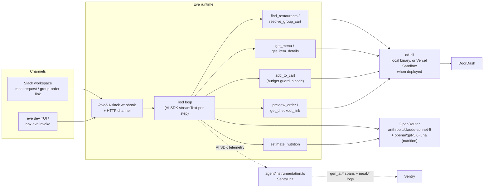
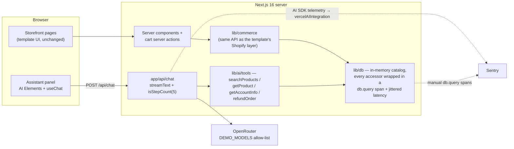
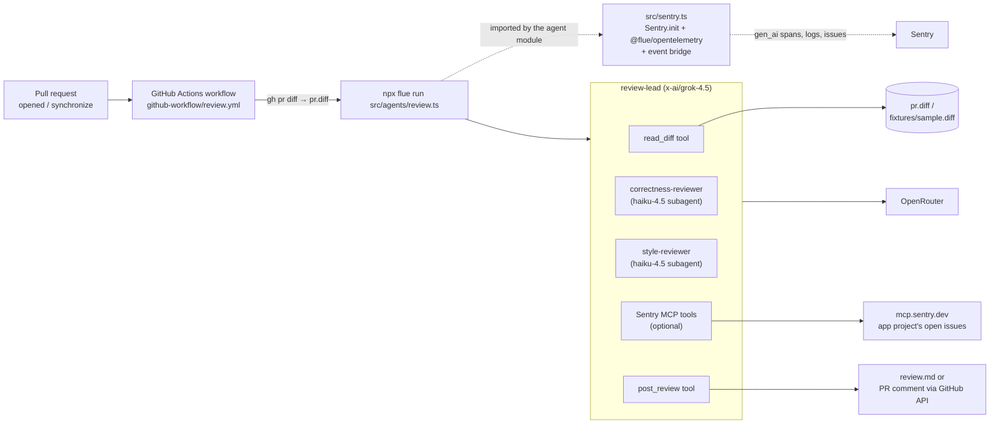

# Architecture

How each demo is built, how one user action becomes one Sentry trace, and how
to run it. All three produce the same data model — a `gen_ai.invoke_agent`
container with model-call and `gen_ai.execute_tool` children — from three
different sources:

1. **slack-agent-eve** — the Eve framework registers `@ai-sdk/otel` with the AI
   SDK. Sentry's `vercelAIIntegration` maps those spans onto `gen_ai.*` ops.
2. **storefront-commerce** — the app calls `streamText` itself. The same
   integration produces the spans, and hand-written `db.query` spans nest under
   the tool spans.
3. **github-harness-flue** — Flue's `@flue/opentelemetry` adapter emits
   `gen_ai.*` spans itself. Sentry only owns the tracer provider.

Common ground:

- Every model call goes through OpenRouter, with the raw model slug passed
  through unchanged, so Sentry's pricing data resolves `gen_ai.cost.*`.
- `tracesSampleRate` is 1 in all three (demo setting).
- Prompt and response recording is on. These are demos; full conversations on
  spans are the point.
- Content capture is spelled the same way in all three:
  `SENTRY_AI_RECORD_INPUTS` and `SENTRY_AI_RECORD_OUTPUTS`, each on when unset
  and off when set to `false`. Every demo resolves the pair once and
  passes it both to `dataCollection.genAI` on `Sentry.init` and to its
  framework's own content switch — Eve's `recordInputs` / `recordOutputs`, the
  storefront's `telemetry` options on `streamText`, Flue's adapter
  `contentPolicy()`. The framework switch decides what is emitted; the SDK
  policy decides what is kept, and both read the same two booleans.
- Sentry SDK 10.70.0 everywhere — `@sentry/node` in the Eve and Flue demos,
  `@sentry/nextjs` in the storefront.

Model-call spans are named differently by source. `vercelAIIntegration` maps
`ai.streamText.doStream` to `generate_content <model>` (op
`gen_ai.generate_content`); Flue's adapter emits `chat <model>` with
`gen_ai.operation.name` set to `chat`. Both are values from the OpenTelemetry
GenAI spec.

---

## 1. slack-agent-eve — DoorDash ordering bot on Eve

### Purpose

"Mealbot" does two jobs from Slack. Ask it for a meal and it finds nearby
restaurants, builds three picks from one menu, prices the cart, and hands back
a DoorDash checkout link. Post a group-order link and it resolves the shared
cart instead. **It never submits an order.**

It shows how to trace an agent loop you do not own: Eve picks when to call the
model and runs the tools; the demo hooks Sentry into Eve's single
instrumentation seam. It also shows a tool that makes its own LLM call
(`estimate_nutrition`), which lands as a nested agent call inside the tool
span, and domain wide events (`meal.pick.added`) carrying the calories and
protein of every pick.

### Architecture

Eve builds the agent from the filesystem: `agent/instructions.md` is the system
prompt, `agent/agent.ts` wires an OpenRouter provider instance as the model
(bypassing the Vercel AI Gateway), and each file in `agent/tools/` becomes a
tool named after the file. Tools shell out to `dd-cli` — the installed binary
locally, the same CLI inside a named Vercel Sandbox when deployed.



There is no official Eve integration; `agent/instrumentation.ts` composes both
sides' documented primitives:

- Eve auto-discovers the file. Its `setup` callback runs `Sentry.init` at server
  startup, which registers the global OpenTelemetry tracer provider. Its
  `functionId` is `AGENT_NAME` (`mealbot`), which names the agent in Sentry's AI
  views — without it Eve falls back to the package name.
- `Sentry.vercelAIIntegration({ force: true })` does two jobs. It subscribes to
  `ai` 7's `ai:telemetry` diagnostics channel and opens its own `gen_ai.*`
  spans, and it installs the span processors that map Eve's `@ai-sdk/otel`
  spans onto matching `gen_ai.*` ops. That mapping is what the AI product runs
  on: without it those spans arrive as `op:default`. Left alone, the processors
  attach only once Sentry's `Modules` integration finds `ai` in the
  `package.json` of the process working directory — which a built server need
  not start from. `force: true` attaches them unconditionally.
- The cost of both paths running is duplication: every model and tool call gets
  two spans, told apart by origin (`auto.vercelai.channel` for the
  diagnostics-channel copy, `auto.vercelai.otel` for Eve's). Both copies carry
  the same `gen_ai.usage.*` attributes, so filter by origin when you sum tokens
  in a hand-written query.
- Content capture is one switch: `dataCollection.genAI.inputs/outputs`, driven
  by `SENTRY_AI_RECORD_INPUTS` / `SENTRY_AI_RECORD_OUTPUTS` — the same flags feed
  Eve's own `recordInputs` / `recordOutputs`.
- The trace lifecycle is left at the default (segment). Streaming export buffers
  spans, and a Vercel function freezes as soon as it responds, so buffered spans
  are lost.
- `traceChannelRequests: true` wraps inbound channel HTTP requests in a SERVER
  span, so a trace starts at the webhook, not at the first model call.
- The `step.started` event hook runs on the same execution path as the step's
  model call. It calls `Sentry.setConversationId(threadTs)` (the Slack thread is
  the conversation), sets the same value as a `gen_ai.conversation.id` tag so
  error events carry it, calls `Sentry.setUser` (enriched asynchronously from
  `users.info`), and returns `runtimeContext` that stamps `slack.channel_id` /
  `slack.user_id` onto every AI span.
- `beforeSendSpan` re-stamps `gen_ai.conversation.id` and `user.id` on `gen_ai`
  spans from a cross-context stash. Eve can create a step's spans in a replay
  context that cannot reach the isolation scope the hook wrote to.

Tools contain **no manual Sentry spans**. Eve's tool calls already become
`gen_ai.execute_tool`, and duplicating them would double-count the AI Agents
dashboard's Tool Errors widget.

### Call stack → span tree

| Call stack | Span produced | Emitted by |
| --- | --- | --- |
| Slack POSTs the event to the webhook | `POST /eve/v1/slack` — `http.server` | Eve's `traceChannelRequests` |
| Eve starts a turn | `eve.turn` (raw OTel name `ai.eve.turn`; the integration strips the `ai.` prefix) | Eve's own tracer |
| Each step calls `streamText` | `invoke_agent mealbot` and `generate_content <model>` | `vercelAIIntegration`, from the AI SDK's telemetry |
| Eve executes a tool (shells to `dd-cli`) | `execute_tool <tool>` with `gen_ai.tool.*` attributes | Same |
| `estimate_nutrition` calls `generateObject` itself | a nested `invoke_agent nutrition-estimator` → `generate_content openai/gpt-5.6-luna` inside the tool span | Same — the telemetry covers every AI SDK call in the process |

```text
POST /eve/v1/slack                       http.server — inbound Slack webhook
└─ eve.turn                              opened and ended inside step 1
   └─ invoke_agent mealbot               step 1
      ├─ generate_content anthropic/claude-sonnet-5
      └─ execute_tool find_restaurants   shells out to dd-cli

invoke_agent mealbot                     step 2 — own segment of the same trace
├─ generate_content anthropic/claude-sonnet-5
└─ execute_tool get_menu

invoke_agent mealbot                     step 3
├─ generate_content anthropic/claude-sonnet-5
└─ execute_tool estimate_nutrition
   └─ invoke_agent nutrition-estimator   the tool's own OpenRouter call
      └─ generate_content openai/gpt-5.6-luna
```

Two shapes to know:

- Every span in that tree exists **twice**, once per origin (see above). The
  tree lists each one once.
- Only step 1 runs inside `eve.turn`. Later steps restore the turn's trace
  context as a *remote* parent, which makes each one a local root: same trace,
  own segment, exported on its own. That is what lets a turn's later steps reach
  Sentry on a serverless runtime.

Local runs (`eve dev`, `eve invoke`) produce the same tree under the HTTP
channel's server span instead of the Slack webhook.

### Spans vs logs

Spans are the **system** record and are entirely auto-instrumented — tool
arguments, models, tokens, latency. Logs are the **domain** record, written by
hand where the business event happens. Nothing is mirrored across both.

| Event | Written by | Carries |
| --- | --- | --- |
| `meal.restaurant.presented` | `present_restaurant_options` | craving, option index, store, store id |
| `meal.option.presented` | `present_meal_options` | store, option index, lane, item, price, budget, calories, protein |
| `meal.pick.added` | `add_to_cart` | item, quantity, price, budget, calories, protein |
| `meal.checkout.offered` | `get_checkout_link` | store, total, currency |

Every one of them also carries `gen_ai.conversation.id` and `user.id` from the
conversation stash, so logs join the trace and the Slack user. The numeric
attributes are typed, so Explore, dashboards, and metric alerts can sum them.

### Running it

```bash
cd slack-agent-eve
npm install
cp .env.example .env    # OPENROUTER_API_KEY + SENTRY_DSN
npm run dev             # eve dev TUI — the full agent loop locally
npx eve invoke "Options for this group order please: https://drd.sh/cart/XXXX/"
npm run seed            # backdated fixture spans, so spend views are not empty
```

`dd-cli` must be installed and signed in on the same machine. A group-order link
only resolves if that DoorDash account hosts or joined the cart. The Slack
surface, the tunnel setup, and the deploy steps are in the demo's README.

In Sentry:

- **Insights → AI Agents** — the `mealbot` agent: runs, token usage, model cost,
  tool error rate.
- **Explore → Traces** — one trace per turn, with prompts and outputs on spans.
- **Explore → Conversations** — each Slack thread is one conversation, with the
  Slack display name in the User column.
- **Explore → Logs** — the `meal.*` events, with the numeric attributes a
  nutrition dashboard and metric alerts sum (calories and protein per user).

---

## 2. storefront-commerce — AI shopping assistant in Next.js

### Purpose

A real storefront (the Next.js Commerce template on Next 16) with an AI shopping
assistant in a slide-over panel. It shows agent tracing living *inside* a normal
application trace: the same fake database serves the storefront pages and the
agent's tools, so `db.query` spans appear in ordinary page-load traces *and*
nested under `gen_ai.execute_tool` spans.

### Architecture



- **Data layer**: `lib/commerce` re-implements the template's Shopify contract
  (same function names, signatures, and types) on top of `lib/db`, so every
  template component works unchanged. `lib/db`'s `query()` wrapper runs each
  accessor inside `Sentry.startSpan({ op: "db.query", name: "<parameterized
  SQL>", attributes: { "db.system.name": "sqlite", "db.operation.name": …,
  "db.query.text": … } })` with 20–120 ms of jittered latency — what Queries
  insights needs to parse and aggregate a span as a database query.
- **Assistant**: AI Elements components around `useChat`. Tool results render as
  generative UI — product and account cards that link into the storefront — via
  the AI SDK's typed `tool-*` message parts.
- **Chat route** (`app/api/chat/route.ts`, Node runtime): `streamText` with the
  OpenRouter provider, four zod-schema tools, `stopWhen: isStepCount(5)`, and
  `telemetry: { functionId: "shopping-assistant" }`, which names the agent in
  the AI Agents dashboard. `streamText` resolves rather than throws when the
  provider fails, so an `onError` callback calls `Sentry.captureException`.
  Before the AI call the route runs `Sentry.setUser(shopper)`,
  `Sentry.setConversationId(id)` (the `useChat` session id from the request
  body), and sets the same id as a tag so errors are searchable back to the
  chat.
- **Fixtures over sign-in**: the store has no auth. `x-demo-shopper` and
  `x-demo-model` request headers pick a shopper from `lib/demo-user` and a model
  from the `DEMO_MODELS` allow-list in `lib/ai/models.ts` (default
  `anthropic/claude-sonnet-5`). Both fall back to the defaults, so a header can
  only choose between fixtures. `x-demo-run` tags a seeded batch.
- **Sentry setup**: manual `@sentry/nextjs` wiring — `instrumentation.ts`,
  `sentry.server.config.ts`, `sentry.edge.config.ts`, `instrumentation-client.ts`
  (session replay at 1.0), `app/global-error.tsx`, and `withSentryConfig` in
  `next.config.ts` with `tunnelRoute: true`; source-map upload is disabled when
  `SENTRY_AUTH_TOKEN` is unset, so builds pass with zero env vars. The server
  config registers `Sentry.vercelAIIntegration()` with no options and spells out
  every `dataCollection` category, because supplying that key at all switches
  the baseline to the SDK defaults. Its `genAI` entry is
  `lib/sentry-content-capture.ts`, shared by all three runtimes;
  `next.config.ts` mirrors the two variables into `NEXT_PUBLIC_*` names so the
  browser bundle can read them.

### Call stack → span tree

"Where is my order?" in the assistant panel:

| Call stack | Span produced | Emitted by |
| --- | --- | --- |
| `useChat` POSTs to the route | `POST /api/chat` — `http.server` | `@sentry/nextjs` HTTP auto-instrumentation |
| Route sets user + conversation id | no span — isolation-scope state the AI spans below pick up | manual |
| `streamText(...)` starts the loop | `invoke_agent shopping-assistant` — `gen_ai.invoke_agent` | `vercelAIIntegration` (named by `functionId`) |
| Model call, decides to use a tool | `generate_content <model>` — `gen_ai.generate_content` | `vercelAIIntegration` |
| AI SDK executes `getAccountInfo` | `execute_tool getAccountInfo` — `gen_ai.execute_tool` | `vercelAIIntegration` |
| Tool calls `db.selectCustomer(...)` | `SELECT * FROM customers WHERE id = ?` — `db.query` | **manual** `Sentry.startSpan` in `lib/db`'s `query()` |
| Tool calls `db.selectOrders(...)` | `SELECT * FROM orders WHERE customer_id = ? ORDER BY created_at DESC LIMIT ?` | manual, same wrapper |
| Model reads the tool result, answers | `generate_content <model>` | `vercelAIIntegration` |

The manual `db.query` spans nest under the tool span with no plumbing: the AI
SDK runs the tool's `execute` inside the tool-call span's context, and
`Sentry.startSpan` parents to whatever span is active.

```text
POST /api/chat                                          http.server
└─ invoke_agent shopping-assistant                      gen_ai.invoke_agent
   ├─ generate_content anthropic/claude-sonnet-5        gen_ai.generate_content
   ├─ execute_tool searchProducts                       gen_ai.execute_tool
   │  └─ SELECT * FROM products WHERE title LIKE ? OR description LIKE ? OR tags LIKE ?
   │                                                    db.query  (~20–120 ms)
   ├─ generate_content anthropic/claude-sonnet-5        model reads the tool result
   ├─ execute_tool getAccountInfo
   │  ├─ SELECT * FROM customers WHERE id = ?           db.query
   │  └─ SELECT * FROM orders WHERE customer_id = ? ORDER BY created_at DESC LIMIT ?
   │                                                    db.query
   └─ generate_content anthropic/claude-sonnet-5        final answer
```

`refundOrder` adds one more shape — and the demo's planted bug. Orders placed
before the June 2026 payments launch have no payment row, so `selectPayment`
throws for them (`1029` is one). Nothing in the tool catches it: the AI SDK
turns the rejection into a tool-error result the model can apologize for, and
Sentry's VercelAI integration captures the exception, so a manual capture would
duplicate the issue. The browser records a replay for every session, so the
issue links to one.

```text
   └─ execute_tool refundOrder                          error status on legacy orders
      ├─ SELECT * FROM orders WHERE customer_id = ? AND id = ? LIMIT 1     db.query
      ├─ SELECT * FROM payments WHERE order_id = ? LIMIT 1                 db.query
      │  ↳ Error: Order 1029 predates the payments launch and has no charge to refund
      └─ POST https://api.acmepay.test/v1/refunds       http.client
                                                        (only when a payment row exists)
```

Storefront page loads produce ordinary Next.js traces whose `db.query` spans
(`SELECT * FROM products WHERE handle = ?`, `INSERT INTO carts (id) VALUES (?)`,
…) come from the same fake database — the demo's point of comparison between
classic tracing and agent tracing. Cart server actions also write a
`commerce.cart.updated` log; `refundOrder` writes `commerce.refund.issued`.

### Running it

```bash
cd storefront-commerce
npm install
cp .env.example .env.local   # OPENROUTER_API_KEY + NEXT_PUBLIC_SENTRY_DSN
npm run dev                  # http://localhost:3000
npm run traffic              # 20 scripted conversations across six shoppers
```

Click the sparkles button (bottom right) and try:

- "Find me a hoodie" → `searchProducts` → product cards
- "Where is my order?" → `getAccountInfo` → account card
- "Refund order 1029" → `refundOrder` → the planted failure
- Then browse a product page and add to cart, for non-agent traces.

In Sentry:

- **Insights → AI Agents** — the `shopping-assistant` agent: runs, token usage
  and cost per model, tool call counts and errors.
- **Insights → Queries** — the parameterized SQL aggregates as if a real SQLite
  database were behind the store, with callers from both page routes and the
  chat route.
- **Explore → Traces** — the waterfall above, with full prompts, outputs, and
  tool arguments on the `gen_ai` spans.
- **Explore → Conversations** — each `useChat` session is one conversation.

---

## 3. github-harness-flue — PR review harness in a GitHub Action

### Purpose

A headless multi-agent code reviewer that runs as one `flue run` invocation in
CI. A lead agent reads the PR diff, delegates parallel review passes to two
subagents, optionally checks the diff against the app's open Sentry issues over
MCP, synthesizes the findings, and posts the review. It shows tracing a
short-lived, multi-agent process: subagent delegation as nested `invoke_agent`
spans, tool logs as Sentry Logs, terminal failures as exactly one Issue, and a
reliable flush before the process exits.

### Architecture



- **Agent module** (`src/agents/review.ts`): one `'use agent'` function using
  Flue's hooks — `useModel('openrouter/x-ai/grok-4.5', { thinkingLevel: 'low' })`,
  two `useSubagent` declarations pinned to
  `openrouter/anthropic/claude-haiku-4.5`, and two `useTool`s. OpenRouter is
  Flue's built-in provider, so the model specifier plus `OPENROUTER_API_KEY` is
  the whole wiring.
- **Sentry impact check**: when `SENTRY_ACCESS_TOKEN`, `SENTRY_ORG_SLUG`, and
  `SENTRY_APP_PROJECT_SLUG` are set, the lead mounts `useMcpConnection` against
  the hosted Sentry MCP server and can search, read, and resolve issues in the
  *app's* project. Two projects are involved on purpose: the agent's own
  telemetry goes to the `SENTRY_DSN` project, the issues it reasons about live
  in the app's.
- **Sentry wiring** (`src/sentry.ts`): Flue's `tooling/sentry@1` blueprint plus
  the deltas the demo's README lists. `Sentry.init` registers the global OTel
  tracer provider; `instrument(createOpenTelemetryInstrumentation(...))` makes
  Flue emit spec-compliant `gen_ai.*` spans into it. Key options:
  - `traceLifecycle: 'stream'`, so spans ship as they finish and `gen_ai`
    children that end after their parent are not lost. `beforeSendSpan` is
    wrapped in `Sentry.withStreamedSpan` — a bare callback silently downgrades
    the lifecycle to static.
  - Sentry's provider-SDK integrations (`Anthropic_AI`, `OpenAI`,
    `Google_GenAI`, `LangChain`, `LangGraph`, `VercelAI`, `WorkersAI`) are
    **filtered out of the defaults by name**. Flue already emits one `chat` span
    per model turn, so leaving them on double-counts every model call.
  - `SENTRY_AI_RECORD_INPUTS` / `SENTRY_AI_RECORD_OUTPUTS` are read once into
    two booleans, which go to `dataCollection.genAI` on this `Sentry.init` and
    to the adapter's `contentPolicy()`. The adapter is not a Sentry
    integration and reads no Sentry option, so passing it the same booleans is
    what keeps the two in step. Whatever is recorded is scrubbed of sensitive
    keys and truncated to 16 KiB per attribute.
- **Event bridge**: a second `instrument({...})` maps Flue's runtime events to
  Sentry Issues (terminal failures only, deduplicated per submission by failure
  type and message) and Sentry Logs (every `log.*` line a tool writes, plus a
  leveled log per submission-recovery event). No breadcrumbs. Its `dispose` awaits
  `Sentry.flush(2000)`; it is registered *before* the OTel adapter so the
  runtime disposes it *after*, once the adapter has ended every open span.
- **Conversation stitching**: a delegation opens a child conversation with its
  own id, which the adapter writes as `gen_ai.conversation.id`. The bridge
  remembers the first conversation seen for a submission; `beforeSendSpan` then
  rewrites later spans to that root and keeps the child id as
  `flue.conversation.id`, so one review is one row in Conversations instead of
  three. The same callback relabels `gen_ai.agent.name` on subagent spans,
  which otherwise arrive under the lead's name, and moves the adapter's
  `flue.tool.call.*` payloads onto the `gen_ai.tool.call.*` keys Sentry's AI
  views read.
- **Critical placement detail**: `flue run` loads only the agent module — never
  `app.ts` — so `review.ts` begins with `import '../sentry.ts'`. On exit the CLI
  disposes the instrumentation, which flushes.

### Call stack → span tree

All spans below come from Flue's adapter; Sentry captures them because
`Sentry.init` owns the global tracer provider. No Sentry span code exists
outside `src/sentry.ts`. Turn count varies with the model's plan.

```text
invoke_agent review-lead
├── chat x-ai/grok-4.5                   plans, asks for the diff
├── execute_tool read_diff               loads the diff; log.info → Sentry Logs
├── chat x-ai/grok-4.5                   delegates both passes in one batch
├── invoke_agent correctness-reviewer    ┐ parallel subagent tasks
│   └── chat anthropic/claude-haiku-4.5  │ off-by-one + swallowed HTTP errors
├── invoke_agent style-reviewer          │
│   └── chat anthropic/claude-haiku-4.5  ┘ var, dead code, naming
├── execute_tool mcp__sentry__search_issues        ┐ Sentry impact check, when
├── execute_tool mcp__sentry__get_sentry_resource  │ configured — each with a
├── execute_tool mcp__sentry__update_issue         ┘ POST mcp.sentry.dev child
├── chat x-ai/grok-4.5                   synthesizes the combined review
├── execute_tool post_review             writes review.md / comments on the PR
└── chat x-ai/grok-4.5                   closing verdict
```

Each `chat` span carries token usage and cost; `gen_ai.agent.name` attributes
usage to the lead or to each subagent. Spans, logs, and issues all carry the
`flue.*` correlation keys (`flue.instance.id`, `flue.agent.name`,
`flue.submission.id`, …) plus the run's root `gen_ai.conversation.id`, so one
search pivots across every signal of a run.

Note the signal split: a tool that throws is a model-visible tool error (span
with error status, plus the error text back to the model) and **not** a Sentry
Issue. Only a failed operation or a failed submission becomes an Issue.

### Running it

```bash
cd github-harness-flue
npm install
cp .env.example .env     # OPENROUTER_API_KEY + SENTRY_DSN
npm run demo             # reviews fixtures/sample.diff, writes review.md
npm run demo:fix         # reviews the diff that fixes it — the Sentry impact path
npm run demo:tool-error  # asks for a path that does not exist — the recovery path
```

Progress streams to stderr, the verdict prints to stdout, exit code 0 means the
submission completed. For CI, copy `github-workflow/review.yml` into the target
repository's `.github/workflows/` and add `OPENROUTER_API_KEY`, `SENTRY_DSN`,
and `SENTRY_ACCESS_TOKEN` as repository secrets; the workflow sets everything
else.

In Sentry:

- **Insights → AI Agents** — `review-lead` and both reviewers, with per-agent
  token usage and cost.
- **Explore → Traces** — the multi-agent tree above; the two subagent
  `invoke_agent` spans overlap in time.
- **Explore → Logs** — the tools' `log.info` lines, trace-correlated and
  carrying the `flue.*` tags.
- **Issues** — force a terminal failure (an invalid `OPENROUTER_API_KEY`) and
  exactly one issue appears, tagged with the same correlation ids as the trace.

`SENTRY_TRACES_SAMPLE_RATE` must be > 0 or the adapter is never registered and
you get errors and logs only.

---

## Comparing the three instrumentation approaches

| | AI SDK auto-instrumentation (`vercelAIIntegration`) | Framework-native OTel (`@flue/opentelemetry`) | Manual spans (`Sentry.startSpan`) |
| --- | --- | --- | --- |
| Used in | storefront-commerce, slack-agent-eve | github-harness-flue | the storefront's `db.query` and gateway spans |
| Span source | Sentry produces the `gen_ai.*` spans from the AI SDK's telemetry | The framework emits spec-compliant `gen_ai.*` spans; Sentry provides the tracer provider | You write op, name, and attributes yourself |
| Code cost | One integration in `Sentry.init`; no span code | One blueprint file; no span code | A wrapper per operation |
| Naming the agent | One lowercase kebab-case name, pinned as `telemetry.functionId` on the call (Eve: `functionId` on the instrumentation) | Same convention, pinned as the agent's durable identity — the `agentName` static on the lead, the `name` option on each subagent | No agent span here; if you build one, set `gen_ai.agent.name` yourself to the same convention |
| Content capture | `SENTRY_AI_RECORD_INPUTS` / `SENTRY_AI_RECORD_OUTPUTS` → `dataCollection.genAI` on `Sentry.init`, and the same booleans to the call's `recordInputs` / `recordOutputs` | The same two variables → `dataCollection.genAI` and the adapter's `contentPolicy()`, which narrows per direction and truncates | No `gen_ai` content on these spans; if you add any, gate it on the same two booleans yourself |
| Conversation + user | `Sentry.setConversationId` / `setUser` before the call, plus a `gen_ai.conversation.id` tag for error events | The framework's own conversation id lands on the span; `setUser` once at startup, and the correlation tags put the id on issues. Child conversation ids are rewritten to the run's root | `Sentry.setConversationId` / `setUser` before the span |
| Watch out for | Every model call producing two spans when both the diagnostics channel and the OTel processors are active; tell them apart by origin | Sentry's provider-SDK integrations double-counting model calls — filter them out of the defaults | Getting the spec right: JSON-stringified attributes, token totals that *include* cached and reasoning subsets |

**Reach for the AI SDK integration** whenever the agent loop runs on the Vercel
AI SDK — whether you call `streamText` yourself (storefront) or a framework does
it for you (Eve). You get the whole
`invoke_agent → generate_content / execute_tool` tree, token usage, and cost for
free. Your jobs are naming the agent, opting into content recording, and setting
conversation and user on the isolation scope before the call.

**Reach for a framework's own Sentry/OTel integration** when the framework emits
OTel spans natively (Flue). Sentry's SDK *is* an OTel SDK: `Sentry.init`
registers the global tracer provider, so the framework's spans land in Sentry
with no exporter or collector. Prefer the framework's official blueprint when
one exists — Flue's also bridges logs, issues, and flushing.

**Reach for manual spans** for what the integrations cannot see — here, the fake
database and the fake payment gateway. They nest under tool spans with no
plumbing, because `Sentry.startSpan` parents to the active span. The same API is
the fallback for a full manual `gen_ai.*` tree (a raw provider-SDK tool loop with
no framework), following
[Sentry's manual agent instrumentation docs](https://docs.sentry.io/platforms/javascript/guides/node/agent-tracing/manual-instrumentation/).
None of these demos hand-write `gen_ai` spans: where an automatic path exists,
manual agent spans on top double-count the dashboards.
